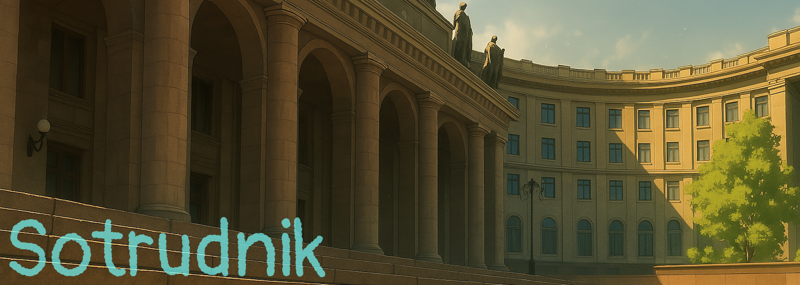

# 🧪 SOTRUDNIK
Игровой проект на Ren'Py: детективная визуальная новелла с интерактивными элементами.

  
  
  

💬 *"Я не знаю, как сюда попал. Но теперь я — сотрудник. И мне нужно разобраться, прежде чем станет слишком поздно."*

## 🎮 Описание

**SOTRUDNIK** — это визуальная новелла в жанре **исекай с элементами детектива, психологического хоррора и повседневности**. Игроку предстоит раскрыть тайны таинственного научного института и найти путь домой, перемещаясь по локациям, взаимодействуя с персонажами и решая головоломки.

Особенности:
- 🌌 Нелинейный сюжет с разветвлёнными выборами  
- 🧩 Головоломки: сигналы, шифры, визуальные загадки  
- 🧭 Свободное перемещение по локациям  
- 📦 Инвентарь и взаимодействие с предметами  
- 🎧 Атмосферный саундтрек и стилизованная визуальная подача  

## 🛠️ Технологии
- 🎮 **Ren'Py** — визуальный движок, основанный на Python  
- 🖋 Сценарий с поддержкой меток, переменных и условных переходов  
- 🧠 Кастомная логика для инвентаря и взаимодействий  

## 🚧 Статус разработки
Разработка активна.  
🎯 Релиз — **в 2025 году**
